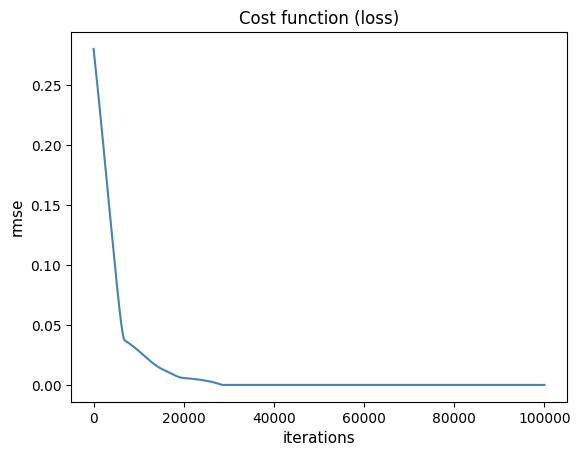
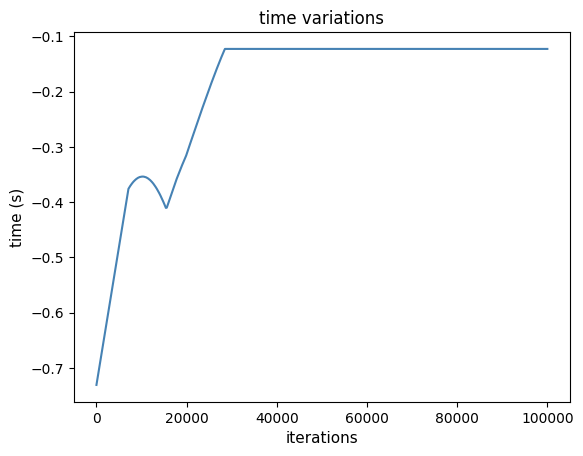
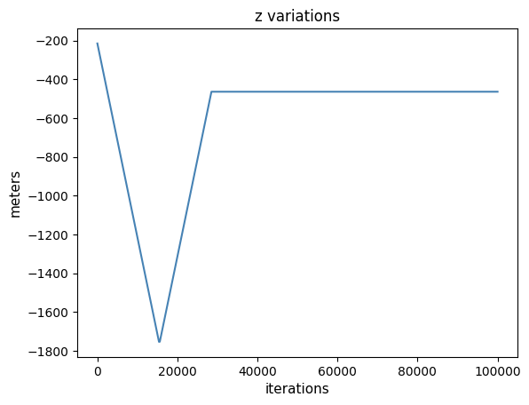

# Earthquake-location
This repository contain different method to locate earthquake in a higly simplified environment. 

### There are 3 scripts:
**gradient_descent.py**: this module contains function to compute gradient descent through exploration algorithms.
  - print_sample_array: function to plot samples array as dictionary.
  - centrering: function to normalise (centralise) stations and event if given.
  - calc_misfit: function to calculate misfit between observed and calculated arrival times.
  - descente_gradient: function to make a gradient descent from a given test event and data from stations.
  - ensemble_descent: function to make a gradient descent with many samples in a vectorised method.

**graph.py**: this module contain functions to plot the state of the search and the history of the localisation of the earthquake.
  - plot_dict_stations: function to plot the position of the station, the true event and of the tested earthquake(s) model(s) if given.
  - plot_vect_stations: function to plot the position of the station, the true event and of the tested earthquake(s) model(s) if given.
  - plot_history_dict: function to plot the evolution of the variables.
  - plot_history_vect: function to plot the evolution of the variables.
  - plot_history_vect_ed: function to plot the evolution of the variables for the ensemble descente method.
  - plot_diff_cost_evol: function to plot the change in variation of the rmse through the epochs.
  - plot_diff_cost_evol_ed: function to plot the change in variation of the rmse through the epochs for the ensemble descente method.

**example.py**: this script contain exemples on how to use the functions from gradient_descent.py and graph.py.

## The single descente method:
The computation time for one use is ~ 1.7 second.

### Plots:
Here are examples and statistics of descente_gradient function:I have made the function runs from 5 000 random initialization for a same earthquake. As we can see on the first plot, all models reach a small value of RMSE. But if we look at the second plot we can see that some run actually gets lost with a distance between the model and the true hypocenter larger than 800 meters. This comes from the fact that all stations have an altitude equal to zero. Consequently, for the algorithm the altitude can be positive or negative without effect on the loss. It also highlights the importance of the initialisation with some that can lead to absurd results. Still, even with these limitations, the third plot shows that the convergence is actually mostly a success with a distance between the model and the prediction lower than 15 meters.

The following plots shows: the history of the loss of a model, the history of the time predicted by the model, the history of the depth predicted by the model and the history of x and y prediction on a map with the position of the stations and of the event.

## The ensemble descente method:
The computation time for one use higly depends on thenumber of samples. For the parameter given in example () it took ~ . second.

### Explanations
The ensemble descente method is a vectorised inmplementation of multiple single descente. It will train multiple earthquake models independently but at the same time. The goal is to reduce the influance of random parameter initialization.

### Plots

# Versions:

### 1.0
Implementation of the single descente method and associated plot functions.

#### 1.1
Implementation of the ensemble descente method and associated plot functions.
