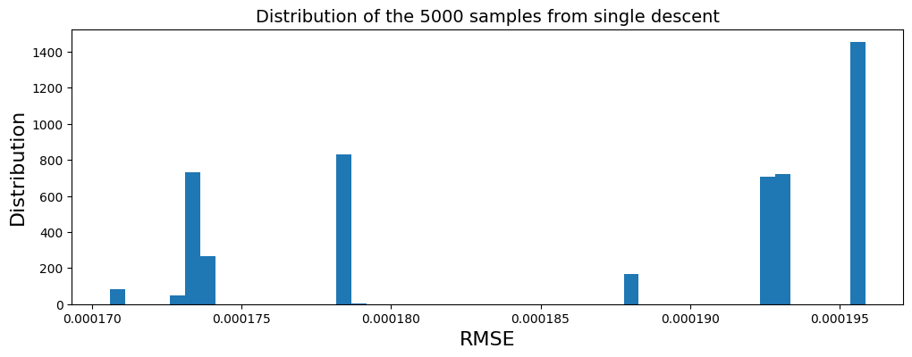
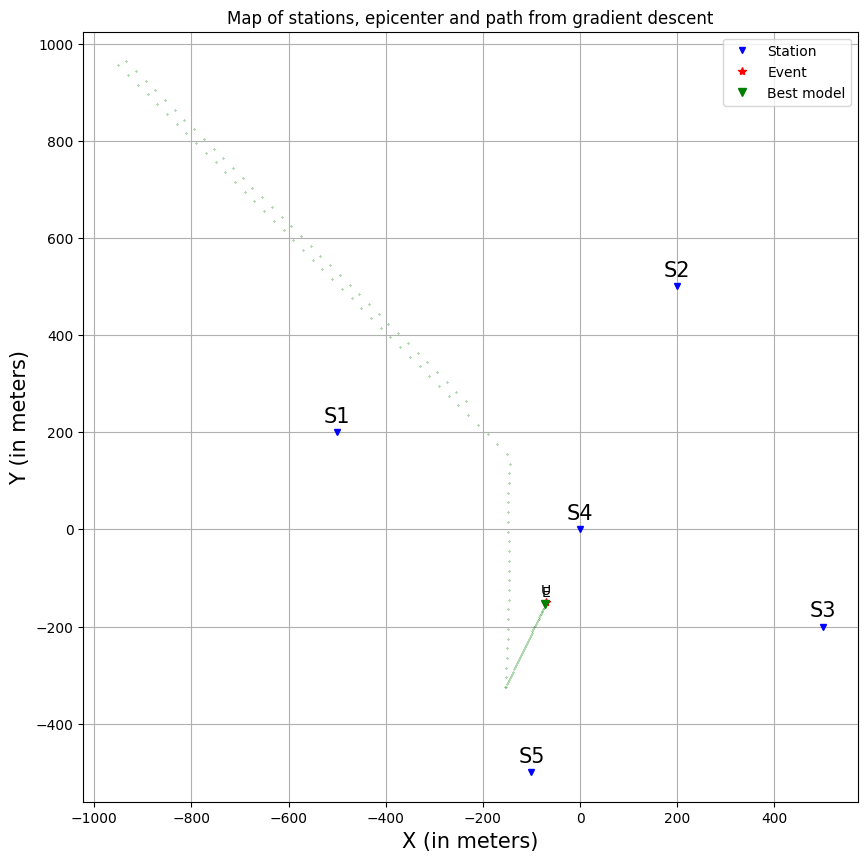
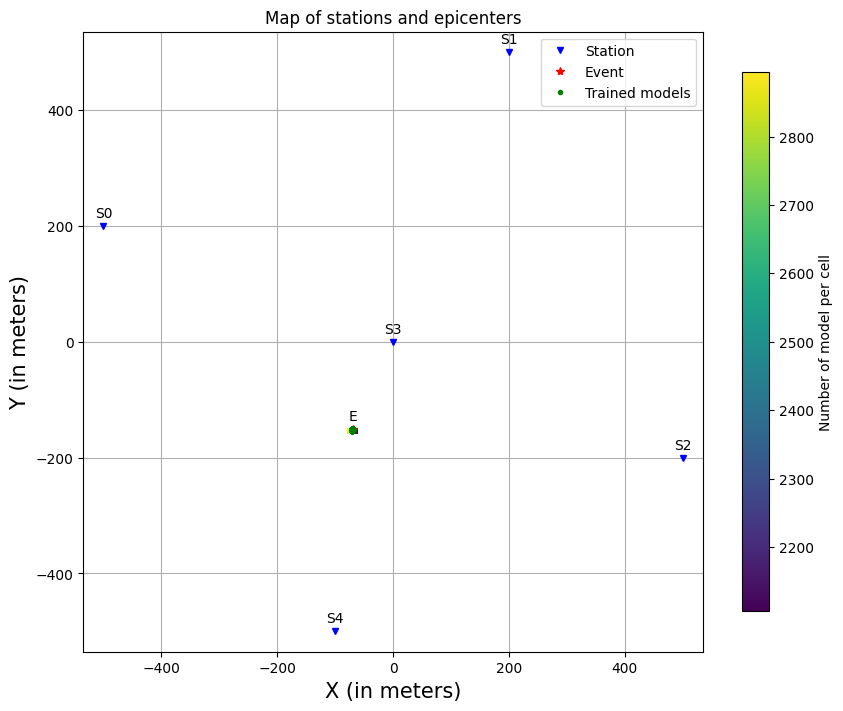
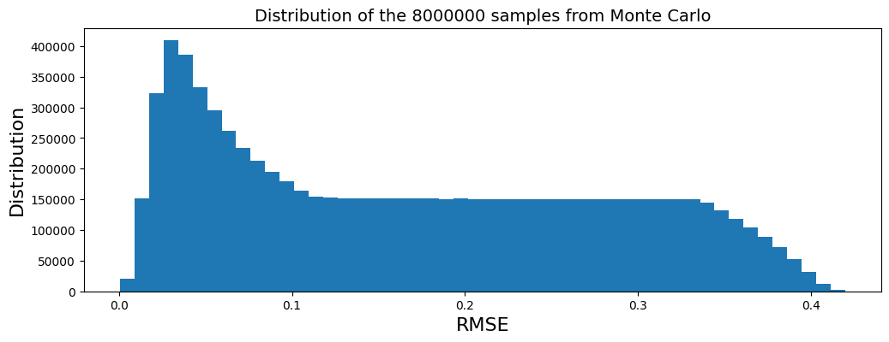

# Earthquake-location
This repository contain different method to locate earthquake in a higly simplified environment. 

### There are 3 scripts:
**gradient_descent.py**: this module contains function to compute gradient descent through exploration algorithms.
  - print_sample_array: function to plot samples array as dictionary.
  - centrering: function to normalise (centralise) stations and event if given.
  - calc_misfit: function to calculate misfit between observed and calculated arrival times.
  - gradient_descent: function to make a gradient descent from a given test event and data from stations.
  - ensemble_descent: function to make a gradient descent with many samples in a vectorised method.
  - monte_carlo: function to compute a Monte Carlo method.
  - deepening_grid_search: function to compute a deepening grid search method.

**graph.py**: this module contain functions to plot the state of the search and the history of the localisation of the earthquake.
  - plot_dict_stations: function to plot the position of the station, the true event and of the tested earthquake(s) model(s) if given.
  - plot_vect_stations: function to plot the position of the station, the true event and of the tested earthquake(s) model(s) if given.
  - plot_history_dict: function to plot the evolution of the variables.
  - plot_history_vect: function to plot the evolution of the variables.
  - plot_history_vect_ed: function to plot the evolution of the variables for the ensemble descent method.
  - custom_2d_hist: a custom function to compute 2d hitogram on the evolution of a population of models.
  - show_density_history_ed: function to show the evolution of the variables for the ensemble descent method through density plots.
  - plot_diff_cost_evol: function to plot the change in variation of the rmse through the epochs.
  - plot_diff_cost_evol_ed: function to plot the change in variation of the rmse through the epochs for the ensemble descent method.

**example.py**: this script contain exemples on how to use the functions from gradient_descent.py and graph.py.

## Single descent method:
The computation time for one use is less than 0.5 second.

### Explanations:
For this method, it first create a random earthquake model, with (x, y and z) position and the time difference between its emission time and receving time at the reference station. It compute the root mean square error (rmse) between the predicted arrival time and the observed arrival time at the stations. It then test each parameters to see if by modifing it by a $\delta$ value it decrease the rmse and if it is the case, keep the modification.

### Plots:
Here are examples and statistics of descent_gradient function: I have made the function runs from 5 000 random initialization (minimum to maximum x and y stations position's, z=-500, and t=-0.5) for a same earthquake. As we can see on the first plot, all models reach a small value of RMSE. The third plot shows that the convergence is mostly a success with a distance between the model and the prediction lower than 15 meters.

The following plots shows the history of the loss of a model, the history of the time predicted by the model, the history of the depth predicted by the model and the history of x and y prediction on a map with the position of the stations and of the event.

## Ensemble descent method:
The computation time for one use higly depends on the number of samples. For 5 000 samples and 23 001 epochs it took ~ 49.6. seconds.

### Explanations:
The ensemble descent method is a vectorised inmplementation of multiple single descent. It will train multiple earthquake models independently but at the same time. The goal is to reduce the influance of random parameter initialization.

### Plots:
The first plot is the Root MeanSquare Error distribution of the 5 000 samples after their training. We can see that they are all lower than 0.00024 and seems to have a distribution close to the single method RMSE. The shape of the distribution is not the same because the training method is sligthly different. In the single, each parameter are adjust one after the other whereas they are adjust all together in the ensemble method. Further more, in the single method, a parameter could be unchage wich is not a possible case in the ensemble method. It may be interesting to add an other kernel feature in the future for the ensemble method.

The second plot shows the distance between the samples and the true targeted event. As for the single method we can see that the distances are quite low, but they aren't as good either. The closet model is still at ~ 8.94 meter of the target. The average distance is also higher. Even if the results are less good, this method is intersting because it train many samples in a lower amount of time which give more robust statistical resluts faster.

The first, second and third plots shows the history of the losses, the time predicted, and the depth predicted by the models while trainig respectivly. The fourth plot show the distribution of x and y model's predictions on a map with the position of the stations and of the event.

## Monte Carlo method:
Time computing for $8*10^6$ samples is less than 1 second.

### Explanations:
For the implementation of Monte Carlo method, I choose to add two possible sampling method.
The first one is to simply draw n random values for each parameters from an uniform law. This will give us n samples. It is a very fast method, but there need to be enougth samples draw, otherwise part of the parameter space will not be explored.
The second method of sampling will first define a 4d grid with a total of cells equal to the integer of the fourth root of the asked number samples n. Then it will move randomly these samples within their cell following an uniform law. This method gives better sampling of parameters, but is also slower.

### Plots:
The first picture show the position of the sations on X and Y axis with the targeted event and the best earthquake model. The second plot is the distribution of the error of the samples.The third plot is the distribution of the distances between the samples and the targeted event.

## Deepening grid search method:
Time computing for a cut frequency of 10 and 50 epochs is less than 0.1 second.

### Explanations:
This method works by deffining a regular grid which split the parameters space into n cells. The total number of cell is equal to n^(number of parameter). It compute the root mean square error of the nodes, then take the one with the lower error as the current node. It compute a new grid of nodes around the current node with the same number a celle, but with smaller bounds (we are zooming in). And then again compute the rmse, choose the node with lowest error, define it as current node, ect...

The main idea of this method is to zoom iteratively into the space of the parameters to find the solution. Consequently, if the number of cell is too low, the training can go in the wrong direction and get lost. There are (at least) three major improvement possibles. The first one is to keep the nodes and their loss from the i-1 iteration, and make the model enable to also serche at the second lowest error. This could help the model if it goes in the wonrg direction (i.e. a local minima). The second is increase or decrease the number of cells through the iteration. The last possibility would be to make random sampling from the cells and the averaging the results to make it more robust to local minima.

### Plots:
The first plot shows the evolution of the loss through iterations. We can see it will some times increase. This comes from the fact that we are evaluating a cell and so a surface only based one one point. Thus when we zoom in, the new dots will not be at the same positionS (even if they are in the same cell) and may all have higher loss. Yet the model is converging rapidly. The second plot and third plot are the evolution of time of emission and depth respectively. We can see that they are having big variation at the start of the training before converging. The times where the depth and time have high changes are correlated with the increase of error in the loss curve. The last plot shows the evolution following x and y-axis of the model. We can see that the position of the model and of the targeted event are almost perfectly superposed.

# Versions:

#### 1.0
Implementation of the single descent method and associated plot functions.

#### 1.1
Implementation of the ensemble descent method and associated plot functions.

#### 1.2
Implementation of the Monte Carlo method.

#### 1.3
Implementation of the deepening grid search method.

#### 2.0
Implementation of genetic algorithm method.

