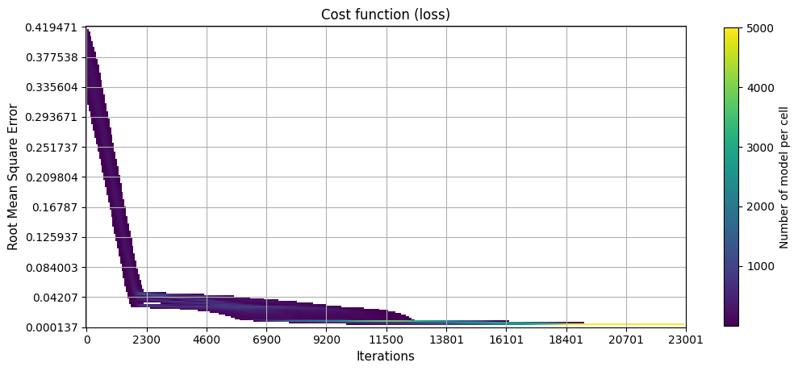
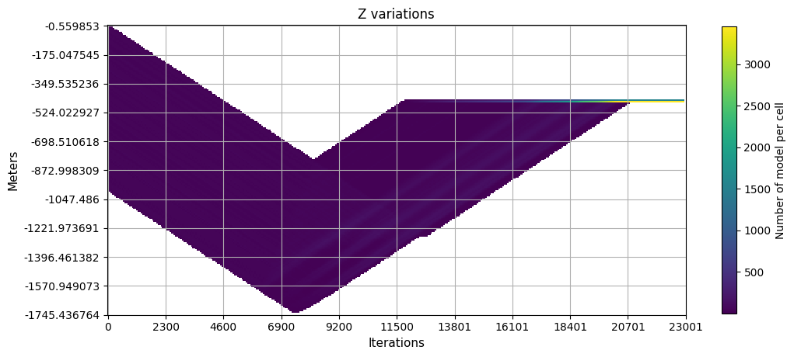

# Earthquake-location
This repository contain different method to locate earthquake in a higly simplified environment. 

### There are 6 scripts:
**gradient_descent.py**: this module contains function to compute gradient descent through exploration algorithms.
  - print_sample_array: function to plot samples array as dictionary.
  - centrering: function to normalise (centralise) stations and event if given.
  - calc_misfit: function to calculate misfit between observed and calculated arrival times.
  - gradient_descent: function to make a gradient descent from a given test event and data from stations.
  - ensemble_descent: function to make a gradient descent with many samples in a vectorised method.
  - monte_carlo: function to compute a Monte Carlo method.
  - deepening_grid_search: function to compute a deepening grid search method.

**genetic_alg.py**: this module contain functions to compute gradient descent to localise the earthquake through a genetic algorithm.
  - print_sample_array: function to plot samples array as dictionary.
  - rmse: calculate misfit between observed and calculated arrival times using numpy ndarrays.
  - randoms: function to create random samples with a given type of pdf and parameters.
  - selections: function to make selectionof the bests samples for givens scores, samples and the number to be kept.
  - means: function to radomly create couple of samples and retrun their average value.
  - cross: function to radomly create couple of samples and retrun their random mix values.
  - mutants: function to create mutants samples from the survivor samples.
  - evolution: function to search a sample with the better parameters possible through genetic algorithm.

**graph.py**: this module contain functions to plot the state of the search and the history of the localisation of the earthquake.
  - plot_dict_stations: function to plot the position of the station, the true event and of the tested earthquake(s) model(s) if given.
  - plot_vect_stations: function to plot the position of the station, the true event and of the tested earthquake(s) model(s) if given.
  - plot_history_dict: function to plot the evolution of the variables.
  - plot_history_vect: function to plot the evolution of the variables.
  - plot_history_vect_ed: function to plot the evolution of the variables for the ensemble descent method.
  - custom_2d_hist: a custom function to compute 2d hitogram on the evolution of a population of models.
  - show_density_history_ed: function to show the evolution of the variables for the ensemble descent method through density plots.
  - plot_diff_cost_evol: function to plot the change in variation of the rmse through the epochs.
  - plot_diff_cost_evol_ed: function to plot the change in variation of the rmse through the epochs for the ensemble descent method.

**create_data.py**: this script is used to create data to train and test machine learning algorithms.
 - compute_box: function to compute the center of the cells of a 3d box.
 - noise_box: function to compute random new positions for each X i-th positions within given boundaries.
 - uppsample_box: function to compute a random sampling of the cells of the box.
 - compute_timing: function to compute the arrival time of the stations and the noise that will be add to them.
 - XY_normalization_X: function to normalize the x and y position of the stations in the X matrix.
 - XY_normalization_y: function to normalize the x, y and z position of the earthquakes.
 - centering_X: function to transform the time between the stations and the earthquake to the relative arrival time.

**example.py**: this script contain examples on how to use the functions from gradient_descent.py, genetic_alg.py and graph.py.

**xgboost_localisator.py**: this script is made to create, train, test and save a xgboost tree model.
 - hist_dist: function to compute, show and save the figure of the distribution of the distance between the predicted and the true position of the earthquakes.


### Running:
To run the scripts, you can execute them from IDE (such as PyCharm or Spyder) or use comand line : ```python script.py```.

## Single descent method:
The computation time for one use is less than 0.5 second.

### Explanations:
For this method, it first create a random earthquake model, with (x, y and z) position and the time difference between its emission time and receving time at the reference station. It compute the root mean square error (rmse) between the predicted arrival time and the observed arrival time at the stations. It then test each parameters to see if by modifing it by a $\delta$ value it decrease the rmse and if it is the case, keep the modification.

### Plots:
Here are examples and statistics of descent_gradient function: I have made the function runs from 5 000 random initialization (minimum to maximum x and y stations position's, z=-500, and t=-0.5) for a same earthquake. As we can see on the first plot, all models reach a small value of RMSE. The third plot shows that the convergence is mostly a success with a distance between the model and the prediction lower than 15 meters.


The following plots shows the history of the loss of a model, the history of the time predicted by the model, the history of the depth predicted by the model and the history of x and y prediction on a map with the position of the stations and of the event.


## Ensemble descent method:
The computation time for one use higly depends on the number of samples. For 5 000 samples and 23 001 epochs it took ~ 49.6. seconds.

### Explanations:
The ensemble descent method is a vectorised inmplementation of multiple single descent. It will train multiple earthquake models independently but at the same time. The goal is to reduce the influance of random parameter initialization.

### Plots:
The first plot is the Root MeanSquare Error distribution of the 5 000 samples after their training. We can see that they are all lower than 0.00024 and seems to have a distribution close to the single method RMSE. The shape of the distribution is not the same because the training method is sligthly different. In the single, each parameter are adjust one after the other whereas they are adjust all together in the ensemble method. Further more, in the single method, a parameter could be unchage wich is not a possible case in the ensemble method. It may be interesting to add an other kernel feature in the future for the ensemble method.

The second plot shows the distance between the samples and the true targeted event. As for the single method we can see that the distances are quite low, but they aren't as good either. The closet model is still at ~ 8.94 meter of the target. The average distance is also higher. Even if the results are less good, this method is intersting because it train many samples in a lower amount of time which give more robust statistical resluts faster.


The first, second and third plots shows the history of the losses, the time predicted, and the depth predicted by the models while trainig respectivly. The fourth plot show the distribution of x and y model's predictions on a map with the position of the stations and of the event.







## Monte Carlo method:
Time computing for $8*10^6$ samples is less than 1 second.

### Explanations:
For the implementation of Monte Carlo method, I choose to add two possible sampling method.
The first one is to simply draw n random values for each parameters from an uniform law. This will give us n samples. It is a very fast method, but there need to be enougth samples draw, otherwise part of the parameter space will not be explored.
The second method of sampling will first define a 4d grid with a total of cells equal to the integer of the fourth root of the asked number samples n. Then it will move randomly these samples within their cell following an uniform law. This method gives better sampling of parameters, but is also slower.

### Plots:
The first picture show the position of the sations on X and Y axis with the targeted event and the best earthquake model. The second plot is the distribution of the error of the samples.The third plot is the distribution of the distances between the samples and the targeted event.


## Deepening grid search method:
Time computing for a cut frequency of 10 and 50 epochs is less than 0.1 second.

### Explanations:
This method works by deffining a regular grid which split the parameters space into n cells. The total number of cell is equal to n^(number of parameter). It compute the root mean square error of the nodes, then take the one with the lower error as the current node. It compute a new grid of nodes around the current node with the same number a celle, but with smaller bounds (we are zooming in). And then again compute the rmse, choose the node with lowest error, define it as current node, ect...

The main idea of this method is to zoom iteratively into the space of the parameters to find the solution. Consequently, if the number of cell is too low, the training can go in the wrong direction and get lost. There are (at least) three major improvement possibles. The first one is to keep the nodes and their loss from the i-1 iteration, and make the model enable to also serche at the second lowest error. This could help the model if it goes in the wonrg direction (i.e. a local minima). The second is increase or decrease the number of cells through the iteration. The last possibility would be to make random sampling from the cells and the averaging the results to make it more robust to local minima.

### Plots:
The first plot shows the evolution of the loss through iterations. We can see it will some times increase. This comes from the fact that we are evaluating a cell and so a surface only based one one point. Thus when we zoom in, the new dots will not be at the same positionS (even if they are in the same cell) and may all have higher loss. Yet the model is converging rapidly. The second plot and third plot are the evolution of time of emission and depth respectively. We can see that they are having big variation at the start of the training before converging. The times where the depth and time have high changes are correlated with the increase of error in the loss curve. The last plot shows the evolution following x and y-axis of the model. We can see that the position of the model and of the targeted event are almost perfectly superposed.


## Genetic algorithm method:
Time computing with the parameter given in the example script to reach value of rmse lower than 1e-5 is less than 0.1 second.

### Explanations:
This method works by simulating the evolution of a species under constant environmental selection pressures. The idea is to have the survival of the fittest which minimises the error.

The first step is to create an initial random population. Here we are drawing random x, y, z and t position through a uniform distribution law. We calculate the root mean square error (rmse) for each sample of the population and keep only a percentage alpha of the best (lowest rmse). By doing this, we are simulating the death of the less well adapted individual. To create the new population we will create children of the survivors through different methods. The first one is to simply keep the survivors (survivors childs). The second is to randomly create couples of the survivors samples and to compute the average of their parameters (means childs). The third is to randomly create couples of the survivors samples and to shuffle their parameters (cross childs). The fourth method is to take the survivors samples and to add low level of noise to their parameter (mutants childs). Once all of the new samples are created, we can once again compute their error, select the best ones and produce the next "childs".

The process is reapeted until we reach a treshold wich trigger early stoping or to the last iteration.

This method is sensitive to hyperparameters initialization.
In the following example I used the same hyperparameters as in ./src/example.py . Some of the most important are: the type of noise for the creation of random model, the parameter of the random distribution, the learning rate of the parameters and the survival rate. The size of the population is not to critical as long as it isn't too small (< 50 isn't enough). More model you will have, faster the convergence will be.
The noise type to use for random models, is crucial because if you are drawing a normal law on a uniform distributed phenomena (and conversely) you will start more far away to the best parameters and consequently, the convergence will be longer (up to orders of magnitude). In my case, it was the uniform distribution that worked best.
The parameters of the distribution law ar as critical as the type of distribution. If they are to small, the convergence will be way longer. The same goes if they are to high.
As in nearly every gradient descent algorithm, the learning rate is crucial to be well choose. If it is too big, the model may not converge and it the same if ti is too small. Here each parameters have their own learning rate. The learning rate is in this case used as the standard dévaition of a centered normal law whose sampling gives the value of the mutation of the parameter. The new value will be $x_{new} = x_{past} + N(0, \sigma)$ where $\sigma$ is the learning rate.


### Plots:

We can see on the first plot the distribution of the root mean square error of 5 000 training execution to localise the same earthquake. We can see that all attempt lead to an error lower than the given treshold of $1*10^{-6}$. The triangle shape of the distribution comes from the use of a fixed treshold which will triger the early stoping when reached. Indeed the probability that a model make a big improvement at this lesvel of error is low since the search is random. This effect can also be seen in the second plot.

The second plot shows the distribution of the euclidean distance between the best model of each run and the true position of the earthquake. We can see that all of the model have a distance lower than one meter wich is fairly small. As written before, the shape of the distribution (approxiamtively a lognormal) comes from the use of the treshold.


The first plot shows the evolution of the loss through the gradient descent. We can see that it only took fourteen epochs (including the random initialization step) to reach the treshold of $1*10^{-6}$. Note that the rmse of the first epoch (at index 0) is already low compared to many of the other method which usualy start with rmse closer to 0.3. An other thing we can say is that the steep of loss is constant for all of the epochs. This means that the loss would probably get even lower in a short amount of iteration.

The second plot shows the evolution of the time between the birth of the earthquake and when it was detected by the reference station. We can see that as for the evolution of the loss and of the depth, the model converged very fast without falling (event temporarely) in a local minima. This means that this method with these hyperparameters is quite robust against local minima. Note that this may not be the case for every set of hyperparameters.

The third plot shows the evolution of the predicted depth of the earthquake.

The four plot shows the evolution of the predicted x and y position of the earthquake.


## XGBoost method:
Time computing for the prediction of one (or many) earthquakes is very low, but as we will see, it does not give very great results.

### Explanations:
XGBoost (eXtreme Gradient Boosting) was introduced by [Tianqi and Guestrin] in 2016 in their paper: "XGBoost: A Scalable Tree Boosting System".

For this method, I used the xgboost librabry from Distributed (Deep) Machine Learning Community (DMLC) XGBoost [https://xgboost.readthedocs.io/en/latest/index.html].
For the booster type, I used `dart` intorduced by Korlakai Vinayak and Gilad-Bachrach.

I first created train, valid and test data with `create_data.py` script. I used 20 cut per space dimensions (resulting in $20^{3}$ cells of 50 meters width), witch I have randomly splited between the train, valid and test set with 70%, 15% and 15% respectively. Then for each cell I sample it by creating 10 random earthques located in them. After that it compute the time travel for all of the stations and add noise proportionally to this time travelling. Finally it compute the relative arrival time with the stations number 4 (index 3) compared to the other. The fourth station beeing the closet to the center of the network. In the end I had 56 000 samples in train, 12 000 in valid and 12 000 in test.

The data to predict will be the x, y and z position of the earthquakes. The input data will be the relative arrival time and if asked for the position of the stations.

### Plots:

The three following plots shows the distribution of the distance between the prediction of the model and the real position.

The first plot is for the distribution on the train set wich shows best result with and average distance of 14.36 meters. As we can see, the results are worst than with any other method even on the train set. This is even more the case when we compare the results of the validation and test set. This means that the models didn't well learn how the relative arrival time was linked to the position of the earthquakes. Yet, these results also shows that the model still make better predictions than a random process. With Monte Carlo method, we can see that the average of true to random predictions distance have an average of approximatively 500 meters.

A reason to explain the bad predictions given by the model could be an insufficient number of samples for the training. 56 000 samples may not be enough for the model and let the space to sparsely sampled. What could be done to test this hypotethis would be to recreate a new set of data, but with a higger resampling rate of the cells (from 10 to 50 for example).


The file ./img/3d_positions_dist_error_test_raw.html is a three dimensional plot of the positions predicted by a trained model. The train was done on raw train data with the position of the stations. The colorbar shows the distance between the predition and the true position. The data used for this plot is the test set.

### Feature importances:

In the following plot, the `X` is for the relative x position of a station. The `Y` is for the relative y position of a station. The `Z` is for the relative z position of a station. The `t` is for the relative relative arrival time of a station. The related station is indicated by the number following the `S` letter.

We can see that the model deos not give any weight to the position of the stations and to the relative arrival time of the station number 4. This isn't much surprinsing since these features are constant and thus cannot be used as they are to discriminate the samples for the xgboost model.
.


## Artificial Neural Networl (ANN) method:


### Explanations:
ANN are a type of machine learning algorithm. Its creation was inpired by the biological neural network in animals.
It can be seen as a network of small function working together to approximate a bigger, abstract and complex unknow function.
I have only tested dense neural network, with different depth, width, activation function and dropout.

We can see these ANNs as a stack the equation: $Y_{i+1} = f(W^T*Y_i + B)$


### Plots:


# References

Tianqi, C., and Guestrin, C.. (2016) "XGBoost: A Scalable Tree Boosting System." Proceedings of the 22nd ACM SIGKDD International Conference on Knowledge Discovery and Data Mining, ACM. Crossref, https://doi.org/10.1145/2939672.2939785.

Korlakai Vinayak, R., Gilad-Bachrach, R.. (2015). "DART: Dropouts meet Multiple Additive Regression Trees." Proceedings of the Eighteenth International Conference on Artificial Intelligence and Statistics, in Proceedings of Machine Learning Research 38:489-497. https://proceedings.mlr.press/v38/korlakaivinayak15.html.


# Versions:

#### 1.0
Implementation of the single descent method and associated plot functions.

#### 1.1
Implementation of the ensemble descent method and associated plot functions.

#### 1.2
Implementation of the Monte Carlo method.

#### 1.3
Implementation of the deepening grid search method.

#### 2.0
Implementation of genetic algorithm method.

#### 3.0
Implementation of XGBoost method.

#### 4.0
Implementation of artificial neural network method.

